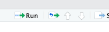
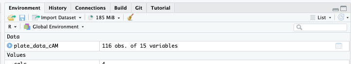
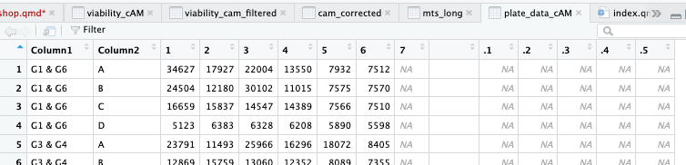

```{r setup, include=FALSE}
knitr::opts_chunk$set(echo = TRUE, message = FALSE, warning = FALSE)
```

# Introduction and Welcome to R!

In this dry prac we will learn how to use **R**, **tidyverse**, and **ggplot2** to analyse the datasets you generated during the BIOL340 wet labs.

Across the practical sequence you have been working on a **mini research project** investigating whether a new experimental drug **Respiranox™** can improve the viability of cells affected by mitochondrial disease.

The project progresses across several stages:

-   **Wet Lab 1:** manual cell counting using a haemocytometer and Trypan Blue staining.
-   **Wet Lab 2:** microplate assays (MTS and Calcein‑AM) used to measure cell viability.
-   **Dry Practical:** analysis of the class dataset using **R** and data visualisation.

The key question we want to answer is:

> **Does Respiranox restore viability in diseased cells, and which concentration appears most effective?**

In this dry prac, we will learn how to use the `ggplot2` and `tidyverse` packages to create publication-quality plots from the data you generated in Wet Lab 1 & 2. Along the way, we will practice data manipulation, such as removing background absorbance and reshaping data for analysis.

R is a powerful tool for analyzing data, creating visualizations, and performing statistical tests. In cell biology, you can use R to analyze experimental results, such as cell growth rates, gene expression levels, or protein abundance.

Let's dive into the basics of R, starting with something fun: exploring cells and their data!

::: callout-note
### ACTION REQUIRED {style="color: red"}

Open R studio on your computer and create a new r script for this class. If you are confused about how to do this refer to the **introduction** section of the BIOL340 practical website.
:::

# Class Objectives

1.  Understand the basics of R including importing data, basic data manipulation, and generating simple plots.
2.  Use R to generate Boxplots and Scatter plots of large datasets generated in your Wet Labs.
3.  Learn to write simple custom lines of R code and utilize generative AI to improve code and correct errors.
4.  Understand the differences between analysis in Microsoft Excel and R, and appreciate situations in which each tool is most useful.
5.  Assess and compare cell viability between ‘diseased’ and ‘healthy’ populations, evaluating the sensitivity and characteristics of each of the microplate assays you completed in Wet Lab

## How to Read This Guide

In the instructions below, there will be chunks of code for you to read and copy into RStudio. The code chunks look like this:

```{r}
#Just a poor empty chunk with no code
```

Anything following a `#` in an R code chunk is a **comment**, which means R will ignore it. These comments are there to help explain what the code is doing.

#### We encourage you to copy and paste the code we provide in these blocks into R studio on your computer. {style="color: red"}

## Getting Started

### Why R?

R is like the mitochondria of data analysis—it's the powerhouse! It can:

-   Analyze large datasets (like transcriptomics data).
-   Create stunning visualizations (like protein localization heatmaps).
-   Perform complex statistical tests (like comparing cell survival rates).
-   Automate repetitive tasks for better reproducibility.

## How to Write Code in R

You write commands (called **functions**) in the **console** or a **script** in RStudio. Below each code chunk, there may be output (often preceded by `#` if you’re looking at raw code). Let's start with a simple one.

Try running this yourself in RStudio! You can either **copy and paste** the code below or type it out manually. I recommend copying for the rest of this guide as it will make it harder to make mistakes, spelling is very important with code as the computer will take everything you write very literally.

We can then run this code using the **run** button in the top right corner.



Or by pressing `control + enter` on your keyboard.

When you run this code in R, you should see the result, **4**, printed beneath.

```{r}
# This calculates a simple sum
2 + 2
```

If you get 4, you've written and executed your first piece of R code. Now things get exciting.

::: callout-note
### Test your understanding {style="color: orange"}

Can you use any other mathematical symbols here? Test it out.
:::

## Working with Variables

Variables are like labeled containers for your data. These are important because we can use them to store all sorts of things in R. Lets store our calculation as the variable **calc** we do this by writing out the variable name, then using a **\<-** symbol then typing what we want to store. Copy the below and test it out for yourself.

We can also check what is stored in a variable by just typing its name and running the code. Let's write **calc** again and see what we have stored. :

::: callout-note
### Test your understanding {style="color: orange"}

Spelling and capitalization are really important. If we captilise the "C" in calc what will happen?
:::

```{r}
# Size of the nucleus
calc <- 2 + 2  # in micrometers

calc
```

It's also possible to store a list of things as a variable. We do this by writing out the list proceeded by a 'c' (for combine), and then seperate every value with a comma. As in the below where we store a list of cool bugs. Because we are using words here(or strings in computer talk) we will use quotations so the computer knows we want it to store exactly the letters we provide it.

You'll notice that i do not use a space between the words 'cool' and 'bugs', in general spaces are not read well by your computer, it doesn't know what to do with them and it will cause your code to fail.

It is best practice to never use spaces in any of your file names or code if possible.

```{r}
#List Nik's favourite bugs
cool_bugs<- c('flies', 'katydids', 'beetles')

#if we list the variable again remeber it will tell us what it contains. 
cool_bugs
```

::: callout-note
### Test your understanding {style="color: red"}

Add in two of your favorite bugs into the `cool_bugs` variable. Then run it to make sure it works.
:::

## Fun with functions

Functions are one of the most powerful tools in R. They allow us to perform tasks without having to write the same code over and over. A function takes an **input**, does something with it, and then gives back an **output**. You’ve already used one function without realizing it— **`+`**, which is the addition function!

For example, let's use the function `sqrt()` to calculate the square root of our `calc` variable.

```{r}
sqrt(calc)  # This finds the square root of 4
```

Many functions take arguments that you can customize. For example, the `round()` function rounds numbers to a specified number of decimal places:

```{r}
round(3.14159, digits = 2)  # Rounds to 2 decimal places
```

We will use a lot of different functions to do powerful things in our data analysis!

::: callout-note
### Test your understanding {style="color: orange"}

Calculate the square root of your `calc` variable then round it to 4 decimal places.
:::

## Visualizing Data and Installing and Loading Packages

R can make many types of plots. Let's plot our nucleus sizes using **ggplot2**, which is included in the **tidyverse**.

If you haven't installed the **tidyverse** package yet, you can do so via copying and running the below code. We will also install two other useful packages that we will use later in the prac.

```{r install-packages, eval=FALSE}
# Install packages (only run this once)
install.packages("tidyverse")
install.packages("plotly")
install.packages("ggpubr")
```

We also have to load the libraries by copying and running this line of code:

```{r}
library(tidyverse)  # Loads ggplot2, dplyr, tidyr, and more
library(plotly)
library(ggpubr)
```

We are now set up to start looking at our data from **Wet Lab 1**

# Visualizing Cell Counts and Concentration from Wet Lab 1

In Wet Practical 1, you determined cell concentration and the number of live and dead cells for *healthy* and *diseased* samples.

We can now import this data for the entire class and visualize it using **ggplot2**. Remember, *working directories* are important in R.

Remember for this class it's not important to understand everything that is happening in the code, just to be able to run it and use Gen AI to edit it.

::: callout-note
### Action required {style="color: red"}

Copy the below code and change the location of the file in the `read.csv` function to where you file is stored on your computer. Remember we keep the text in quotations so the computer interprets it literally as what we type.
:::

```{r eval=FALSE}
# Load your data using read.csv().
# file.choose() opens a window so you can select the file on your computer.

Class_data <- read.csv(file.choose())

head(Class_data)
```

```{r include=FALSE}
# This hidden chunk is used only so the Quarto document can render online.
# It loads a copy of the dataset stored inside the project folder.
Class_data <- read.csv("~/git/BIOL340_DP/pages/DP1/cell_data.csv")
```

If you are curious the functions in the above code chunk do the following: - `setwd()` sets your working directory. - `read.csv()` imports a CSV file. - `mutate()` modifies or adds columns. - `head(Class_data)` prints the first 6 rows, so you can quickly inspect your dataset.

## Making a Boxplot

Now we can analyse this data in interesting ways using ggplot2 a package specifically for graphing included in `tidyverse`. Feel free to play around with labels, colours and themes.

A boxplot helps compare data distributions across categories.

The below package ggplot() builds graphs in layers.

First we tell R which dataset to use `ggplot(Class_data)`. Then we need to tell it what we actually want plotted from this data set, or the asthetics of the graph, this is shortened to list `aes()`, i.e. `ggplot(Class_data, aes(x = x-axis, y = y axis)`. In the below we also tell it to treat the column `cell_concentration` in our data as a numeric factor this just means it will plot it correctly.

We also will add a **geom** to our plot, this is short for a geometric object - which basically means dots, lines, curves or any other thing we might like to plot. For now we will add a boxplot geom using `geom_boxplot`. \>Data scientists are not very creative when it comes to naming things, but this means with a bit of thinking, googling or AI searching we can pretty quickly work out what a function or option is doing.

```{r box-plots}
ggplot(Class_data, aes(x = Treatment, y = as.numeric(CellConcentration))) +
  geom_boxplot() +
  theme_minimal()

```

::: callout-note
### Test your understanding {style="color: orange"}

If you are curious, try changing the aesthetics for the y axis to just be y = cell_concentration to see how it tries to plot the data. What is going on?
:::

::: callout-note
### Test your understanding {style="color: orange"}

Look at your result from week 1, was you groups data an outlier?
:::

We can also tidy up this graph and improve how it looks by using options under `labels()` which allows us to add axes and figure labels. We can also use `theme()` which allows us to manipulate different visuals in the graph, in this instance I will use theme_minimal which is a theme included with ggplot, but there are a huge number of customisations you can do by manipulating options within `theme()`. Observe the below changes.

```{r}
#coloured boxplot
p <- ggplot(Class_data, aes(x = Treatment, y = as.numeric(CellConcentration), color = Treatment)) +
  geom_boxplot() +
  labs(
    title = "Concentration of viable vs. treatment",
    x = "Treatment",
    y = "Cell concentration"
  ) +
  theme_minimal()
# Display the plot
p
```

## Question 1 {style="color: red"}

> What changed between the first and second box plots you created? How is this reflected in the code?

## Activity 1 {style="color: red"}

> Make a custom graph with interesting aesthetics. Use generative AI (e.g., ChatGPT or Copilot) to get ideas on what to change (colors, theme, legend placement, etc.). You can copy and paste your code into co-pilot and chatGTP and ask for it to change things based on what you would like to see.

# Analysing Wet Lab 2 Data in R

In this section we will work through the analysis of the **MTS and Calcein-AM microplate assay data** from Wet Lab 2.

The aim of this analysis is to determine how the different treatments affected cell viability. In particular, we want to compare:

-   Healthy cells
-   Diseased cells
-   Treated cells – 10 µM Respiranox
-   Treated cells – 20 µM Respiranox
-   Non-viable cells
-   Media / blank wells

In the wet lab, each treatment was measured in **triplicate wells**. This is important because it allows us to average replicate measurements and reduce the effect of random error.

#### **Our overall workflow will be:**

1.  **Import the raw plate data**
2.  **Reshape the plate layout into long format**
3.  **Label each well with its treatment condition**
4.  **Average the triplicate wells for each treatment**
5.  **Average the blank wells for each group**
6.  **Subtract the blank signal from each treatment mean**
7.  **Calculate relative viability compared with the healthy control**
8.  **Make plots to visualise the results**

# Import the data

The assay data should be saved as a two seperate `.csv` files available on Moodle.

### ACTION REQUIRED {style="color: red"}

Download the .csv files for the MTS and calcein-AM assays from Moodle. Then load them into R studio.

## IMPORTANT! {style="color: red"}

> **To help make you more familiar with manipulating code blocks the instructions below will be given only for the Calcein-AM assay. Please make sure you repeat the instructions for MTS as well. This will usually only require changing the names of different objects from cam to MTS and making sure you read in the data correctly.**

```{r eval=FALSE}
# Import the Calcein-AM plate data
# file.choose() lets you manually select the file from your computer

plate_data_cAM <- read.csv(file.choose(), check.names = FALSE)
plate_data_MTS <- read.csv(file.choose(), check.names = FALSE)


##now repeat this for Calcein AM
```

```{r include=FALSE}
# This hidden chunk is used only so the Quarto document can render online.
# It loads a copy of the dataset stored inside the project folder.
plate_data_cAM <- read.csv("~/git/BIOL340_DP/pages/DP1/cam_plate.csv")
```

### Practical note {style="color: red"}

At this stage it is always a good idea to inspect the file carefully. You can do that by clicking on the name of the object in the data window on right of the RStudio Window:



You should see something like this:\


Ask yourself:

-   Does the data look like the plate layout from the practical?
-   Are the first columns storing the group and row information?
-   Are the measurement columns named `1`, `2`, `3`, etc. or `X1`, `X2`, `X3`?

Different `.csv` files can import slightly differently into R, so checking the structure of the data is an important habit.

------------------------------------------------------------------------

# Reshape the plate data into long format

Right now the data is still arranged like a plate, which is easy for humans to read but not ideal for R.

Our plate currently looks like a spreadsheet. Each column represents a well.

R works better when each row is one measurement.

`pivot_longer()` converts the spreadsheet format into this structure

```{r}
# Convert the raw plate data into long format

cam_long <- plate_data_cAM %>%   # Start with the imported Calcein-AM dataset

  select(1:8) %>%                # Keep only the first 8 columns
                                 # column 1 = Group
                                 # column 2 = Plate row (A–D)
                                 # columns 3–8 = measurement columns

  rename(
    Group = 1,                   # Rename column 1 to "Group"
    Row = 2                      # Rename column 2 to "Row"
  ) %>%

  pivot_longer(
    cols = 3:8,                  # Convert Columns 3-8  into rows
    names_to = "Column",
    values_to = "signal"
  ) %>%

  mutate(
    
# Convert the column labels to text
# Sometimes R imports column names like 1,2,3 as numbers or factors.
# Converting them to characters ensures they behave consistently when we compare them later.

    Column = as.character(Column),
    
# Create well ID that joins togeather the row letter with the column number
# Example: Row = "A" and Column = "1" becomes "A1"
    well = paste0(Row, Column),  


# Create a new column called "condition"
# This assigns each well to its treatment condition
# based on which plate column it came from
    condition = case_when(
      Column %in% c("1","X1") ~ "Healthy",
      Column %in% c("2","X2") ~ "Diseased",
      Column %in% c("3","X3") ~ "Treated cells - 10 uM Respiranox",
      Column %in% c("4","X4") ~ "Treated cells - 20 uM Respiranox",
      Column %in% c("5","X5") ~ "Non-viable cells",
      Column %in% c("6","X6") ~ "Media / blank"
    )
  )

head(cam_long)


mts_long <- plate_data_MTS %>%   # Start with the imported Calcein-AM dataset

  select(1:8) %>%                # Keep only the first 8 columns
                                 # column 1 = Group
                                 # column 2 = Plate row (A–D)
                                 # columns 3–8 = measurement columns

  rename(
    Group = 1,                   # Rename column 1 to "Group"
    Row = 2                      # Rename column 2 to "Row"
  ) %>%

  pivot_longer(
    cols = 3:8,                  # Convert Columns 3-8  into rows
    names_to = "Column",
    values_to = "signal"
  ) %>%

  mutate(
    
# Convert the column labels to text
# Sometimes R imports column names like 1,2,3 as numbers or factors.
# Converting them to characters ensures they behave consistently when we compare them later.

    Column = as.character(Column),
    
# Create well ID that joins togeather the row letter with the column number
# Example: Row = "A" and Column = "1" becomes "A1"
    well = paste0(Row, Column),  


# Create a new column called "condition"
# This assigns each well to its treatment condition
# based on which plate column it came from
    condition = case_when(
      Column %in% c("1","X1") ~ "Healthy",
      Column %in% c("2","X2") ~ "Diseased",
      Column %in% c("3","X3") ~ "Treated cells - 10 uM Respiranox",
      Column %in% c("4","X4") ~ "Treated cells - 20 uM Respiranox",
      Column %in% c("5","X5") ~ "Non-viable cells",
      Column %in% c("6","X6") ~ "Media / blank"
    )
  )

head(cam_long)
head(mts_long)

```

### Practical note {style="color: red"}

At this point each row represents **one well measurement**.\
This structure is much easier for R to analyse and plot.

------------------------------------------------------------------------

# Remove row D

For this analysis we only use rows **A–C**. So we are going to remove row **D** before we make any calculations.

```{r}
cam_filtered <- cam_long %>%
#the fuction filter will remove data
  filter(Row != "D")

write_csv(cam_filtered, 'filtered_camassay_class_data')

mts_filtered <- mts_long

write_csv(mts_filtered, 'filtered_mtsassay_class_data')
```

### Practical note {style="color: red"}

Filtering row D **before calculating means** ensures that row D does not influence the averages.

------------------------------------------------------------------------

# Average the triplicate wells

Each treatment was measured in triplicate wells.\
We now calculate the **mean signal** for each treatment.

```{r}
# Create a new dataset called cam_summary that contains
# the average signal for each treatment within each group

cam_summary <- cam_filtered %>%     # Start with the filtered dataset (rows A–C only)

  # group_by() tells R to split the data into groups
  # Here we separate the data by:
  #   1. Group (student group)
  #   2. condition (treatment type)
  # This means calculations will be done separately
  # for each treatment within each group
  group_by(Group, condition) %>%   

  summarise(
    # Calculate the average signal for each group/treatment combination
    # mean() finds the average value
    # na.rm = TRUE tells R to ignore missing values (NA) if they exist
    mean_signal = mean(signal, na.rm = TRUE))

cam_summary
```

### Practical note {style="color: red"}

Each treatment now has **one average signal value per group**.

------------------------------------------------------------------------

# Calculate blank signal

Blank wells measure background fluorescence from the media and assay reagents.

```{r}
# Create a dataset containing the background (blank) signal for each group

cam_blank_values <- cam_summary %>%     # Start with the dataset that contains
                                        # the average signal for each treatment

  # Keep only the rows corresponding to the blank wells
  # These wells contain media but no cells
  # and therefore measure background fluorescence
  filter(condition == "Media / blank") %>%

  # Rename the column mean_signal to blank_mean
  # This makes it clear that this value represents
  # the average background signal for each group
  select(Group, blank_mean = mean_signal)
```

------------------------------------------------------------------------

# Background correction

Now we subtract the background signal.

```{r}
# Create a new dataset called cam_corrected that contains
# the background-corrected signal for each treatment

cam_corrected <- cam_summary %>%        # Start with the dataset that contains
                                        # the average signal for each treatment

  # Remove the blank rows because we only want to correct
  # the treatment conditions (not the blank itself)
  filter(condition != "Media / blank") %>%

  # Join the blank values back onto the dataset
  # left_join() matches rows using the "Group" column
  # This means each treatment row will now also contain
  # the blank_mean value from the same group
  left_join(cam_blank_values, by = "Group") %>%

  # Create a new column called corrected_signal
  # This subtracts the background fluorescence
  # from the treatment signal
  mutate(
    corrected_signal = mean_signal - blank_mean
  )

# Display the corrected dataset
cam_corrected
```

### Practical note {style="color: red"}

Raw fluorescence contains:

-   cell fluorescence
-   background fluorescence

Subtracting the blank removes this background.

------------------------------------------------------------------------

# Calculate relative viability

Healthy cells are defined as **100% viability**.

```{r}
# Calculate relative cell viability for each treatment


 # Start with the dataset that contains the background-corrected signals
viability_cam <- cam_corrected %>%     
  
  # group_by() separates the data by student group
  # Each group performed their own experiment, so we calculate
  # viability relative to the healthy control within each group
  group_by(Group) %>%

  mutate(
    # Create a new column called relative_viability
    # This compares each treatment signal to the healthy control signal
    # from the same group and expresses it as a percentage

    relative_viability =
      corrected_signal /
      corrected_signal[condition == "Healthy"] * 100
  )

# View the resulting dataset
viability_cam
```

Conceptually:

```         
relative viability (%) =
(sample signal / healthy signal) × 100
```

------------------------------------------------------------------------

# Plot class relative viability

we can now make a simple plot of the entire class data, this will allow us to visualise means and outliers. We will use boxplots as we have before but also make use of another type of geom called `geom_jitter()`. This type of plot will show every single data point from your data and move it (or jitter it) a little bit left or right so you can see multiple data of the same value. This is really good for visualising the density of data around a particular point. To help with visualising this much data at once we will also use a low `alpha` value within `geom_jitter()`, this will increase the transparency with **alpha = 1** being fully opaque and **alpha = 0** being invisible.

```{r}
# Plot relative viability for each treatment, we are also going to add some text into the plot we can refer to later so we know which group made which data.

cam_plot <- ggplot(viability_cam, aes(x = condition, y = relative_viability, colour = condition,)
    ) +
      
  geom_boxplot() +
  # Plot each student group's data point over the top
  geom_jitter(width = 0.15, alpha= 0.5) +

  
  # Add labels to the plot
  labs(
    title = "Relative viability of treatments (Calcein-AM)",
    x = "Condition",
    y = "Relative viability (%)"
  ) +

  # Use a clean theme for the plot
  theme_minimal() +
  
    # Rotate the x-axis labels so they are easier to read
  theme(axis.text.x = element_text(angle = 45, hjust = 1))


cam_plot
```

### ACTION REQUIRED {style="color: red"}

> If there is an obvious outlier in the data see if you can determine which group it came from.

# Preparing data for publication-quality analysis

So far we have explored the data using jitter and box plots. This is useful for identifying trends and potential outliers.

However, when presenting results in a **scientific report or publication**, we usually summarise the data and perform statistical tests to determine whether treatments differ significantly.

Here we will:

1.  Perform a **one-way ANOVA** to test for treatment effects
2.  Use **pairwise t-tests** to compare between treatments
3.  Visualise these statistics on our **boxplots**

------------------------------------------------------------------------

# Statistical analysis of treatment effects

So far we have visualised individual datapoints.

\
This helps us see whether the treatments appear to affect cell viability.

However, to determine whether these differences are **statistically significant**, we need to perform a statistical test.

Because we are comparing **more than two treatments**, we use a method called **Analysis of Variance (ANOVA)**. You should have learnt about this kind of statistical test in 2nd year.

------------------------------------------------------------------------

# Step 1 — Run a one-way ANOVA

ANOVA tests whether the **means of multiple groups are different from each other**.

In this experiment, the factor we are testing is the **treatment condition**.

```{r}
anova_model <- aov(relative_viability ~ condition, data = viability_cam)

summary(anova_model)
```

## Interpretation

Look at the **p-value** in the ANOVA output.

If the p-value is **less than 0.05**, this suggests that **at least one treatment differs significantly from the others**.

However, ANOVA does not tell us **which treatments differ**.

------------------------------------------------------------------------

# Step 2 — Perform pairwise comparisons

To determine which treatments differ from each other, we perform **post-hoc comparisons**.

One commonly used approach is **pairwise t-tests with multiple testing correction**.

```{r}
pairwise_results <- pairwise.t.test(
  viability_cam$relative_viability,
  viability_cam$condition,
  p.adjust.method = "bonferroni"
)

# Convert the p-value matrix to a table
pairwise_table <- as.data.frame(pairwise_results$p.value)

pairwise_table
```

This table shows the **adjusted p-values** for each pair of treatments.

------------------------------------------------------------------------

# Step 3 — Visualise the results on the figure

We can now add these statistical results directly to our boxplot. Will make use of a new package called `ggpubr`.

```{r}
library(ggpubr)

# Define which treatment groups we want to statistically compare
# Each pair represents two conditions that will be tested against each other
# for a significant difference in viability

comparisons <- list(
  c("Healthy", "Diseased"),
  c("Diseased", "Treated cells - 10 uM Respiranox"),
  c("Diseased", "Treated cells - 20 uM Respiranox"),
  c("Treated cells - 10 uM Respiranox", "Treated cells - 20 uM Respiranox"),
  c("Healthy", "Treated cells - 10 uM Respiranox"),
  c("Healthy", "Treated cells - 20 uM Respiranox")
)

# Start creating the plot using ggplot
# The dataset used is "viability_cam"
# x-axis = treatment condition
# y-axis = relative viability

ggplot(viability_cam, aes(x = condition, y = relative_viability, colour = condition)) +
 # Add a boxplot to show the distribution of values for each treatment
  # outlier.shape = NA hides the default outlier points so they don't overlap
  # with the jittered datapoints we add later
  geom_boxplot(outlier.shape = NA, width = 0.6) +

  # Perform a global ANOVA test comparing all treatment groups
  # This tests whether there is ANY difference between the conditions
  # label.y controls where the p-value text appears on the plot
  stat_compare_means(method = "anova", label.y = 140) +

  # Perform pairwise statistical comparisons between specific groups
  # comparisons = the list we created above
  # method = "t.test" performs pairwise t-tests
  # p.adjust.method = "bonferroni" corrects for multiple comparisons
  # label = "p.signif" shows results as significance symbols (*, **, etc.)
  
  stat_compare_means(
    comparisons = comparisons,
    method = "t.test",
    p.adjust.method = "bonferroni",
    label = "p.signif"
  ) +

  # Expand the y-axis slightly so there is room to display the statistical labels
  scale_y_continuous(expand = expansion(mult = c(0.05, 0.25))) +

  # Add plot titles and axis labels
  labs(
    title = "Effect of Respiranox treatment on cell viability",
    x = "Treatment condition",
    y = "Relative viability (%)"
  ) +

  # Use a clean publication-style theme
  theme_classic() +

  # Rotate the x-axis labels so long treatment names fit better
  theme(axis.text.x = element_text(angle = 45, hjust = 1))
```

------------------------------------------------------------------------

# What this figure shows

This final figure includes:

-   the **distribution of the data (boxplots)**
-   the **individual measurements**
-   the **ANOVA result**
-   the **pairwise statistical comparisons**

### Significance labels

-   `ns` = not significant\
-   `*` = p \< 0.05\
-   `**` = p \< 0.01\
-   `***` = p \< 0.001

These comparisons help determine which treatments have significantly different effects on cell viability.Interpretation

------------------------------------------------------------------------

# Activities and questions

## Activity 2 {style="color: red"}

> Customize your plot to improve its appearance. - Adjust point size and color - Modify or remove legends - Evaluate whether you need to show all data labels or tick marks - Explore other themes (e.g., `theme_bw()`, `theme_classic()`). Feel free to look at the ggplot2 cheat sheet available on the dry prac website, we have also provided extra information for plotting under "extra help with graphics"

## Activity 3 {style="color: red"}

> Repeat this plot for the MTS dataset. This should be simple as you will only need to change what variable is plotted by code you already have! The code should remain the same. This is one powerful aspect of R, reproducibility!

## Exporting Plots

In RStudio, use the **Plots** pane (bottom-right) and click **Export** to save your plots as an image (PNG, JPEG) or PDF. You can also programmatically export using `ggsave()`.

Example:

```{r eval=FALSE}
ggsave("myplot.png", plot = p, width = 6, height = 4)
```

## Activity 4 {style="color: red"}

> Export your final R-generated figures for the MTS and Calcein-AM assays as PNG files. Try setting the file dimensions to 600×400.

## Question 4 {style="color: red"}

> Where do these files save on your computer? Why is that location used?

## Question 5 {style="color: red"}

> Write a brief comparison of the two assays you performed. Which was faster, more reproducible, or more sensitive?

## Question 6 {style="color: red"}

> Based on the statistical results:
>
> -   Does **Respiranox treatment improve viability compared to diseased cells?**
> -   Is the **20 µM dose more effective than 10 µM?**
> -   Do treated cells recover to levels similar to **healthy cells**?
>
> These statistical tools help researchers determine whether the observed differences are likely due to the **drug treatment rather than random variation**.

\newpage

# Common Errors and How to Fix Them

Some commonly encountered errors include:

-   **Package not found** → Make sure you’ve installed and loaded the package.
-   **Object not found** → Check for typos in function or variable names.
-   **Incorrect file path** → Check for typos in the file path. Make sure you have set the correct working directory.
-   **Mismatched column names** → R is case-sensitive.

\newpage

# Conclusion

In this Dry Practical, we:

-   Learned how to import and analyse data in both Excel and R.
-   Learnt how to generate **box** and **scatter** plots in R
-   Learnt how to complete some basic data manipulation and cleaning
-   Calculated **relative viability** for different cell treatments.

# Function Glossary

During this practical you used a range of different **R functions** to import data, inspect it, clean it, graph it, and run basic statistics.

A **function** is simply a command that tells R to do something.

This glossary includes **all of the main functions used in this practical**, along with a short explanation and a simple example.

------------------------------------------------------------------------

#### Setup and document functions

`knitr::opts_chunk$set()`

Sets global options for code chunks in an R Markdown or Quarto document.

In this practical it was used to control whether code, warnings, and messages are shown.

knitr::opts_chunk\$set(echo = TRUE, message = FALSE, warning = FALSE)

------------------------------------------------------------------------

#### Installing and loading packages

`install.packages()`

Installs a package so it can be used in R.

You only need to do this once per computer.

install.packages("tidyverse")

------------------------------------------------------------------------

`library()`

Loads a package into your current R session.

You usually need to run this each time you open RStudio.

library(tidyverse) library(plotly) library(ggpubr)

------------------------------------------------------------------------

#### Basic R functions

`sqrt()`

Calculates the square root of a number.

sqrt(4)

------------------------------------------------------------------------

`round()`

Rounds a number to a chosen number of decimal places.

round(3.14159, digits = 2)

------------------------------------------------------------------------

`c()`

Combines multiple values into a single vector.

c("flies", "beetles", "katydids")

------------------------------------------------------------------------

#### Importing and inspecting data

#### `read.csv()`

Imports a `.csv` file into R as a dataset.

data \<- read.csv(file.choose())

------------------------------------------------------------------------

`file.choose()`

Opens a file browser so you can select a file from your computer.

read.csv(file.choose())

------------------------------------------------------------------------

`head()`

Shows the first few rows of a dataset.

Useful for checking whether your file imported correctly.

head(data)

------------------------------------------------------------------------

`names()`

Displays the column names of a dataset.

names(data)

------------------------------------------------------------------------

`unique()`

Shows the unique values in a column.

Useful for checking whether filtering worked correctly.

unique(cam_filtered\$Row)

------------------------------------------------------------------------

`as.numeric()`

Converts values into numeric form.

This is useful when a column has been imported as text instead of numbers.

as.numeric(Class_data\$CellConcentration)

------------------------------------------------------------------------

`as.character()`

Converts values into text.

This is useful when you want to compare column names or labels as text.

as.character(cam_long\$Column)

------------------------------------------------------------------------

#### Data manipulation functions from tidyverse

`select()`

Keeps only selected columns from a dataset.

select(data, Group, Row)

Example from this practical:

select(1:8)

------------------------------------------------------------------------

`rename()`

Changes the names of columns.

rename(data, Group = 1, Row = 2)

------------------------------------------------------------------------

`pivot_longer()`

Converts data from a wide spreadsheet layout into long format.

This is useful when you want each row to represent one measurement.

pivot_longer(data, cols = 3:8, names_to = "Column", values_to = "signal")

------------------------------------------------------------------------

`mutate()`

Creates a new column or changes an existing column.

mutate(data, doubled_value = value \* 2)

Example from this practical:

mutate(corrected_signal = mean_signal - blank_mean)

------------------------------------------------------------------------

`case_when()`

Creates values based on a set of rules.

This is useful when assigning labels such as treatment conditions.

case_when( Column == "1" \~ "Healthy", Column == "2" \~ "Diseased" )

------------------------------------------------------------------------

`filter()`

Keeps only rows that meet a condition.

filter(data, Row != "D")

Example:

filter(condition == "Media / blank")

------------------------------------------------------------------------

`group_by()`

Groups the data so later calculations are done separately within each group.

group_by(data, Group, condition)

------------------------------------------------------------------------

`summarise()`

Calculates summary statistics such as means.

summarise(data, mean_signal = mean(signal))

Example from this practical:

summarise(mean_signal = mean(signal, na.rm = TRUE))

------------------------------------------------------------------------

`left_join()`

Combines two datasets using a shared column.

This was used to add blank values back onto the treatment table.

left_join(dataset1, dataset2, by = "Group")

------------------------------------------------------------------------

#### Other functions

`mean()`

Calculates the average value.

mean(c(2, 4, 6))

Example from this practical:

mean(signal, na.rm = TRUE)

------------------------------------------------------------------------

`paste0()`

Joins pieces of text together with no spaces.

This was used to create well IDs such as `A1` or `B3`.

paste0("A", "1")

------------------------------------------------------------------------

`list()`

Creates a list.

In this practical it was used to define pairs of treatments for statistical comparisons.

list( c("Healthy", "Diseased"), c("Diseased", "Treated cells - 10 uM Respiranox") )

------------------------------------------------------------------------

#### Plotting functions from ggplot2

`ggplot()`

Starts a graph.

You give it a dataset and then add layers.

ggplot(data, aes(x = Treatment, y = viability))

------------------------------------------------------------------------

`aes()`

Short for aesthetics.

This tells ggplot which variables to use for the x-axis, y-axis, colour, and so on.

aes(x = condition, y = relative_viability, colour = condition)

------------------------------------------------------------------------

`geom_boxplot()`

Adds a boxplot layer to a graph.

geom_boxplot()

------------------------------------------------------------------------

`geom_jitter()`

Adds individual points with a little horizontal spread so they do not overlap too much.

geom_jitter(width = 0.15, size = 3)

------------------------------------------------------------------------

`labs()`

Adds a title and axis labels to a graph.

labs( title = "Relative viability of treatments", x = "Condition", y = "Relative viability (%)" )

------------------------------------------------------------------------

`theme_minimal()`

Applies a clean visual style to the plot.

theme_minimal()

------------------------------------------------------------------------

`theme_classic()`

Applies another simple visual style to the plot.

theme_classic()

------------------------------------------------------------------------

`theme()`

Allows you to customise smaller visual details of a plot.

theme(axis.text.x = element_text(angle = 45, hjust = 1))

------------------------------------------------------------------------

`element_text()`

Controls the appearance of text in a plot, such as angle or size.

element_text(angle = 45, hjust = 1)

------------------------------------------------------------------------

`scale_y_continuous()`

Controls the y-axis scale.

In this practical it was used to create extra space above the plot for significance labels.

scale_y_continuous(expand = expansion(mult = c(0.05, 0.25)))

------------------------------------------------------------------------

`expansion()`

Adds extra space around an axis.

expansion(mult = c(0.05, 0.25))

------------------------------------------------------------------------

`ggsave()`

Saves a plot to a file such as PNG or PDF.

ggsave("myplot.png", width = 6, height = 4)

Example from this practical:

ggsave("stat_plot.png", final_plot_cam, width = 6, height = 6)

------------------------------------------------------------------------

Statistical functions

`aov()`

Runs an ANOVA model.

This tests whether there is a difference between the means of multiple groups.

anova_model \<- aov(relative_viability \~ condition, data = viability_cam)

------------------------------------------------------------------------

`summary()`

Displays the results of a model or dataset summary.

Example with ANOVA:

summary(anova_model)

------------------------------------------------------------------------

`pairwise.t.test()`

Performs pairwise t-tests between groups.

This is useful after ANOVA when you want to see which pairs of treatments differ.

pairwise.t.test( viability_cam\$relative_viability, viability_cam\$condition, p.adjust.method = "bonferroni" )

------------------------------------------------------------------------

`as.data.frame()`

Converts an object into a data frame.

This was used to display the pairwise p-values as a table.

as.data.frame(pairwise_results\$p.value)

------------------------------------------------------------------------

Statistical annotation functions from ggpubr

`stat_compare_means()`

Adds statistical comparison results directly onto a ggplot.

It can display a global ANOVA result or pairwise comparison labels.

Example for ANOVA:

stat_compare_means(method = "anova", label.y = 140)

Example for pairwise comparisons:

stat_compare_means( comparisons = comparisons, method = "t.test", p.adjust.method = "bonferroni", label = "p.signif" )

------------------------------------------------------------------------

#### Interactive plotting functions from plotly

`ggplotly()`

Converts a ggplot graph into an interactive plot.

ggplotly(cam_plot)

Interactive plots allow you to hover over points and inspect the data in more detail.

------------------------------------------------------------------------

A very short cheat sheet

Here are the most important functions from this practical:

| Function            | What it does              |
|---------------------|---------------------------|
| `read.csv()`        | imports a dataset         |
| `head()`            | previews the first rows   |
| `filter()`          | removes rows              |
| `group_by()`        | splits data into groups   |
| `summarise()`       | calculates averages       |
| `mutate()`          | creates new columns       |
| `ggplot()`          | starts a graph            |
| `geom_boxplot()`    | draws boxplots            |
| `geom_jitter()`     | plots individual points   |
| `aov()`             | runs ANOVA                |
| `pairwise.t.test()` | compares groups           |
| `ggplotly()`        | makes a graph interactive |

------------------------------------------------------------------------

Final note

You do **not** need to memorise every function in this glossary.

The goal of this practical is to help you:

-   recognise common R commands
-   understand how biological data is analysed
-   build confidence using computational tools in cell biology

###### 
